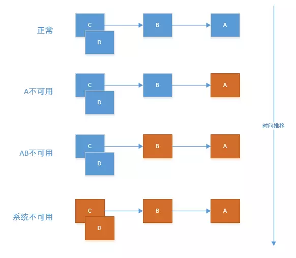

# 服务雪崩效应

基础服务的故障导致级联故障，进而造成了整个分布式系统的不可用，这种现象被称为服务雪崩效应。服务雪崩效应描述的是一种因服务提供者的不可用导致服务消费者的不可用，并将不可用逐渐放大的过程。 

 

## 服务雪崩效应形成的原因 

1. 服务提供者不可用 
   - 硬件故障
   - 程序Bug
   - 缓存击穿
   - 用户大量请求
2. 重试加大流量 
   * 用户重试
   * 代码逻辑重试
3. 服务调用者不可用 
   * 同步等待造成的资源耗尽

## 服务雪崩的应对策略

1. 流量控制 
   * 网关限流
   * 用户交互限流
   * 关闭重试
2. 改进缓存模式
   * 缓存预加载
   * 同步改为异步刷新
3. 服务自动扩容 
   * AWS的auto scaling
4. 服务调用者降级服务 
   * 资源隔离
   * 对依赖服务进行分类
   * 不可用服务的调用快速失败

本篇文章不展开论述各种应对策略，主要探讨微服务自身如何来保护自己，避免奔溃？即微服务如何进行容错设计？容量设计在生活中经常见到，每家每户都有保险丝，用电超负荷了，就会跳闸。微服务的容错组件Hystrix就吸收了这些思想。

# Hystrix

`Hystrix [hɪst'rɪks]`的中文含义是豪猪科动物，如下图所示, 因其背上长满了刺,而拥有自我保护能力.


Netflix的 Hystrix 是一个帮助解决分布式系统交互时超时处理和容错的类库, 它同样拥有保护系统的能力.

## Hystrix如何保护我们的应用？

How Does Hystrix Accomplish Its Goals？

1. Wrapping all calls to external systems (or “dependencies”) in a HystrixCommand or HystrixObservableCommand object which typically executes within a separate thread (this is an example of the command pattern).（通过**HystrixCommand封装外部系统的所有调用**，它会在独立的线程中执行）即命令模式。
2. Timing-out calls that take longer than thresholds you define. There is a default, but for most dependencies you custom-set these timeouts by means of “properties” so that they are slightly higher than the measured 99.5th percentile performance for each dependency.（简单说：**修改超时时间的阈值**，提高依赖的性能）
3. Maintaining a small thread-pool (or semaphore) for each dependency; if it becomes full, requests destined for that dependency will be immediately rejected instead of queued up.（每个依赖**维护一个小的线程池或者信号量**，如果满了，请求调用依赖会被快速聚集而不是排队等待。）即资源隔离
4. Measuring successes, failures (exceptions thrown by client), timeouts, and thread rejections.（测量成功率，失败率、超时次数、线程拒绝率）即服务监控的指标
5. Tripping a circuit-breaker to stop all requests to a particular service for a period of time, either manually or automatically if the error percentage for the service passes a threshold.（当服务的错误率超过阈值时，通过手动或者自动的方式，对一定时间内特定的服务，**采用链路中断器拒绝所有请求**，）即熔断器、熔断机制
6. Performing fallback logic when a request fails, is rejected, times-out, or short-circuits.（在请求失败、拒绝、超时、短路时执行**回退逻辑**）即请求回退
7. Monitoring metrics and configuration changes in near real-time.（近实时监控指标和修改配置。）

下面主要展开讲述**资源隔离、服务降级、服务熔断等功能特性**。

## 资源隔离

### 资源隔离--设计思想来源


货船为了进行防止漏水和火灾等风险的扩散,会将货仓分隔为多个隔离区域,这种资源隔离减少风险的方式被称为:Bulkheads(舱壁隔离模式).

官网关于资源隔离的举例如下：

 

### 两种资源隔离模式

（1）线程池隔离模式：使用一个线程池来存储当前的请求，线程池对请求作处理，设置任务返回处理超时时间，堆积的请求堆积入线程池队列。这种方式需要为每个依赖的服务申请线程池，有一定的资源消耗，好处是可以应对突发流量（流量洪峰来临时，处理不完可将数据存储到线程池队里慢慢处理）

（2）信号量隔离模式：使用一个原子计数器（或信号量）来记录当前有多少个线程在运行，请求来先判断计数器的数值，若超过设置的最大线程个数则丢弃改类型的新请求，若不超过则执行计数操作请求来计数器+1，请求返回计数器-1。这种方式是严格的控制线程且立即返回模式，无法应对突发流量（流量洪峰来临时，处理的线程超过数量，其他的请求会直接返回，不继续去请求依赖的服务）

**区别（两种隔离方式只能选其一）：**

|          | 线程池隔离               | 信号量隔离                  |
| -------- | ------------------------ | --------------------------- |
| 线程     | 与调用线程非相同线程     | 与调用线程相同（jetty线程） |
| 开销     | 排队、调度、上下文开销等 | 无线程切换，开销低          |
| 异步     | 支持                     | 不支持                      |
| 并发支持 | 支持（最大线程池大小）   | 支持（最大信号量上限）      |

**官网对比线程池与信号量**


### 什么时候用线程池 or 信号量？

**默认使用线程池**

**如果不涉及远程**RPC调用（没有网络开销），比如访问内存缓存，则使用信号量来隔离，更为轻量，开销更小。

The Netflix API processes 10+ billion Hystrix Command executions per day using thread isolation. Each API instance has 40+ thread-pools with 5–20 threads in each (most are set to 10).
Netflix API每天使用线程隔离处理10亿次Hystrix Command执行。 每个API实例都有40多个线程池，每个线程池中有5-20个线程（大多数设置为10个）

```java
@HystrixCommand(fallbackMethod = "stubMyService",
    commandProperties = {
      @HystrixProperty(name="execution.isolation.strategy", value="SEMAPHORE")
    }
)
```

线程池核心配置: 

| 参数                         | 解释                                 |
| ---------------------------- | ------------------------------------ |
| coreSize                     | 核心线程数，maxSize也是该值          |
| keepAliveTime                | 空闲线程保留时间                     |
| maxQueneSize                 | 最大队列大小，如果为-1会使用交换队列 |
| queneSizeRejectionThreashold | 当等待队列多大时，将会执行拒绝策略   |
| timeoutInMillSeconds         | 执行线程的超时时间                   |

## 服务降级、回退

降级就是当依赖的服务产生故障时，把产生故障的丢了，换一个轻量级的方案(比如返回一个固定值)，是一种退而求其次的方法。比如微信刚上线红包功能时，过年那天大家都在发红包，很多人都会看到微信会弹出一个相同的页面，这个就是服务降级的使用，当服务不可用时，返回一个静态值（页面）。


1. Fail Fast 快速失败

2. Fail Silent 无声失败

3. Fallback: Static 返回默认值

4. Fallback: Stubbed 自己组装一个值返回

5. Cache via Network 利用远程缓存 

    <!--Sometimes if a back-end service fails, a stale version of data can be retrieved from a cache service such as memcached.  -->

   通过远程缓存的方式。在失败的情况下再发起一次remote请求，不过这次请求的是一个缓存比如redis。由于是又发起一起远程调用，所以会重新封装一次Command，这个时候要注意，执行fallback的线程一定要跟主线程区分开，也就是重新命名一个ThreadPoolKey。 

   

6. Primary + Secondary with Fallback 主次方式回退（主要和次要）

   这个有点类似我们日常开发中需要上线一个新功能，但为了防止新功能上线失败可以回退到老的代码，我们会做一个开关比如(使用zookeeper)做一个配置开关，可以动态切换到老代码功能。那么Hystrix它是使用通过一个配置来在两个command中进行切换。 

   

**回退的处理方式也有不适合的场景**： 


**以上几种情况如果失败，则程序就要将错误返回给调用者。** 

## 熔断器

熔断器就像家里的保险丝，当电流过载了就会跳闸，不过Hystrix的熔断机制相对复杂一些。


**服务的健康状况** = 请求失败数 / 请求总数.

熔断器开关由关闭到打开的状态转换是通过当前服务健康状况和设定阈值比较决定的.

- 当熔断器开关关闭时, 请求被允许通过熔断器. 如果当前健康状况高于设定阈值, 开关继续保持关闭. 如果当前健康状况低于设定阈值, 开关则切换为打开状态.
- 当熔断器开关打开时, 请求被禁止通过.
- 当熔断器开关处于打开状态, 经过一段时间后, 熔断器会自动进入半开状态, 这时熔断器只允许一个请求通过. 当该请求调用成功时, 熔断器恢复到关闭状态. 若该请求失败, 熔断器继续保持打开状态, 接下来的请求被禁止通过.

熔断器的开关能保证服务调用者在调用异常服务时, 快速返回结果, 避免大量的同步等待. 并且熔断器能在一段时间后继续侦测请求执行结果, 提供恢复服务调用的可能.

### 熔断器工作流程图

**英文版（官网原图）**


**中文版**


1. 构建Hystrix的Command对象, 调用执行方法.
2. Hystrix检查当前服务的熔断器开关是否开启, 若开启, 则执行降级服务getFallback方法.
3. 若熔断器开关关闭, 则Hystrix检查当前服务的线程池是否能接收新的请求, 若超过线程池已满, 则执行降级服务getFallback方法.
4. 若线程池接受请求, 则Hystrix开始执行服务调用具体逻辑run方法.
5. 若服务执行失败, 则执行降级服务getFallback方法, 并将执行结果上报Metrics更新服务健康状况.
6. 若服务执行超时, 则执行降级服务getFallback方法, 并将执行结果上报Metrics更新服务健康状况.
7. 若服务执行成功, 返回正常结果.
8. 若服务降级方法getFallback执行成功, 则返回降级结果.
9. 若服务降级方法getFallback执行失败, 则抛出异常

熔断器核心配置: 

| 参数                     | 解释                                            |
| ------------------------ | ----------------------------------------------- |
| enabled                  | 熔断器是否开启，默认开启                        |
| errorThreshlodPercentage | 熔断器容错比率阈值， 默认值50%                  |
| forceClosed              | 是否强制关闭，默认值false                       |
| forceOpen                | 是否强制打开，默认值false                       |
| requestVolumeThreshlod   | 表示请求达到多少时才开始进行熔断计算， 默认值20 |
| sleepWindowInMillseconds | 半开的触发试探休眠时间 默认值5000ms/10000ms     |

那么断路器是在什么情况下开始起作用呢？这里涉及到断路器的三个重要参数：快照时间窗、请求总数下限、错误百分比下限。这个参数的作用分别是：

- **快照时间窗(sleepWindowInMillseconds)：**断路器确定是否打开需要统计一些请求和错误数据，而统计的时间范围就是快照时间窗，默认为最近的10秒。
- **请求总数下限(requestVolumeThreshlod)：**在快照时间窗内，必须满足请求总数下限才有资格根据熔断。默认为20，意味着在10秒内，如果该hystrix命令的调用此时不足20次，即时所有的请求都超时或其他原因失败，断路器都不会打开。
- **错误百分比下限(errorThreshlodPercentage)：**当请求总数在快照时间窗内超过了下限，比如发生了30次调用，如果在这30次调用中，有16次发生了超时异常，也就是超过50%的错误百分比，在默认设定50%下限情况下，这时候就会将断路器打开。

那么当断路器打开之后会发生什么呢？我们先来说说断路器未打开之前，对于之前那个示例的情况就是每个请求都会在当hystrix超时之后返回`fallback`，每个请求时间延迟就是近似hystrix的超时时间，如果设置为5秒，那么每个请求就都要延迟5秒才会返回。当熔断器在10秒内发现请求总数超过20，并且错误百分比超过50%，这个时候熔断器打开。打开之后，再有请求调用的时候，将不会调用主逻辑，而是直接调用降级逻辑，这个时候就不会等待5秒之后才返回fallback。通过断路器，实现了自动地发现错误并将降级逻辑切换为主逻辑，减少响应延迟的效果。

在断路器打开之后，处理逻辑并没有结束，我们的降级逻辑已经被成了主逻辑，那么原来的主逻辑要如何恢复呢？对于这一问题，hystrix也为我们实现了自动恢复功能。当断路器打开，对主逻辑进行熔断之后，hystrix会启动一个休眠时间窗，在这个时间窗内，降级逻辑是临时的成为主逻辑，当休眠时间窗到期，断路器将进入半开状态，释放一次请求到原来的主逻辑上，如果此次请求正常返回，那么断路器将继续闭合，主逻辑恢复，如果这次请求依然有问题，断路器继续进入打开状态，休眠时间窗重新计时。

通过上面的一系列机制，hystrix的断路器实现了对依赖资源故障的端口、对降级策略的自动切换以及对主逻辑的自动恢复机制。这使得我们的微服务在依赖外部服务或资源的时候得到了非常好的保护，同时对于一些具备降级逻辑的业务需求可以实现自动化的切换与恢复，相比于设置开关由监控和运维来进行切换的传统实现方式显得更为智能和高效。

### 测试代码

**（模拟10次调用，错误百分比为5%的情况下，打开熔断器开关。）：** 

```java
import com.netflix.hystrix.*;
import org.junit.Test;

import java.util.Random;

/**
 * Created by wangxindong on 2017/8/15.
 */
public class GetOrderCircuitBreakerCommand extends HystrixCommand<String> {

    public GetOrderCircuitBreakerCommand(String name){
        super(Setter.withGroupKey(HystrixCommandGroupKey.Factory.asKey("ThreadPoolTestGroup"))
                .andCommandKey(HystrixCommandKey.Factory.asKey("testCommandKey"))
                .andThreadPoolKey(HystrixThreadPoolKey.Factory.asKey(name))
                .andCommandPropertiesDefaults(
                        HystrixCommandProperties.Setter()
                                .withCircuitBreakerEnabled(true)//默认是true，本例中为了展现该参数
                                .withCircuitBreakerForceOpen(false)//默认是false，本例中为了展现该参数
                                .withCircuitBreakerForceClosed(false)//默认是false，本例中为了展现该参数
                                .withCircuitBreakerErrorThresholdPercentage(5)//(1)错误百分比超过5%
                                .withCircuitBreakerRequestVolumeThreshold(10)//(2)10s以内调用次数10次，同时满足(1)(2)熔断器打开
                                .withCircuitBreakerSleepWindowInMilliseconds(5000)//隔5s之后，熔断器会尝试半开(关闭)，重新放进来请求
//                                .withExecutionTimeoutInMilliseconds(1000)
                )
                .andThreadPoolPropertiesDefaults(
                        HystrixThreadPoolProperties.Setter()
                                .withMaxQueueSize(10)   //配置队列大小
                                .withCoreSize(2)    // 配置线程池里的线程数
                )
        );
    }

    @Override
    protected String run() throws Exception {
        Random rand = new Random();
        //模拟错误百分比(方式比较粗鲁但可以证明问题)
        if(1==rand.nextInt(2)){
//            System.out.println("make exception");
            throw new Exception("make exception");
        }
        return "running:  ";
    }

    @Override
    protected String getFallback() {
//        System.out.println("FAILBACK");
        return "fallback: ";
    }

    public static class UnitTest{

        @Test
        public void testCircuitBreaker() throws Exception{
            for(int i=0;i<25;i++){
                Thread.sleep(500);
                HystrixCommand<String> command = new GetOrderCircuitBreakerCommand("testCircuitBreaker");
                String result = command.execute();
                //本例子中从第11次，熔断器开始打开
                System.out.println("call times:"+(i+1)+"   result:"+result +" isCircuitBreakerOpen: "+command.isCircuitBreakerOpen());
                //本例子中5s以后，熔断器尝试关闭，放开新的请求进来
            }
        }
    }
}
```

测试结果

```java
call times:1 result:fallback: isCircuitBreakerOpen: false
call times:2 result:running: isCircuitBreakerOpen: false
call times:3 result:running: isCircuitBreakerOpen: false
call times:4 result:fallback: isCircuitBreakerOpen: false
call times:5 result:running: isCircuitBreakerOpen: false
call times:6 result:fallback: isCircuitBreakerOpen: false
call times:7 result:fallback: isCircuitBreakerOpen: false
call times:8 result:fallback: isCircuitBreakerOpen: false
call times:9 result:fallback: isCircuitBreakerOpen: false
call times:10 result:fallback: isCircuitBreakerOpen: false
//熔断器打开
call times:11 result:fallback: isCircuitBreakerOpen: true
call times:12 result:fallback: isCircuitBreakerOpen: true
call times:13 result:fallback: isCircuitBreakerOpen: true
call times:14 result:fallback: isCircuitBreakerOpen: true
call times:15 result:fallback: isCircuitBreakerOpen: true
call times:16 result:fallback: isCircuitBreakerOpen: true
call times:17 result:fallback: isCircuitBreakerOpen: true
call times:18 result:fallback: isCircuitBreakerOpen: true
call times:19 result:fallback: isCircuitBreakerOpen: true
call times:20 result:fallback: isCircuitBreakerOpen: true
//5s后熔断器关闭
call times:21 result:running: isCircuitBreakerOpen: false
call times:22 result:running: isCircuitBreakerOpen: false
call times:23 result:fallback: isCircuitBreakerOpen: false
call times:24 result:running: isCircuitBreakerOpen: false
call times:25 result:running: isCircuitBreakerOpen: false
```

## Hystrix Metrics(指标)的实现

Hystrix的Metrics中保存了当前服务的健康状况, 包括服务调用总次数和服务调用失败次数等. 根据Metrics的计数, 熔断器从而能计算出当前服务的调用失败率, 用来和设定的阈值比较从而决定熔断器的状态切换逻辑. 因此Metrics的实现非常重要. 

#### 1.4之前的滑动窗口实现

Hystrix在这些版本中的使用自己定义的滑动窗口数据结构来记录当前时间窗的各种事件(成功,失败,超时,线程池拒绝等)的计数. 事件产生时, 数据结构根据当前时间确定使用旧桶还是创建新桶来计数, 并在桶中对计数器经行修改.  这些修改是多线程并发执行的, 代码中有不少加锁操作,逻辑较为复杂. 


#### 1.5之后的滑动窗口实现

Hystrix在这些版本中开始使用RxJava的Observable.window()实现滑动窗口. RxJava的window使用后台线程创建新桶, 避免了并发创建桶的问题. 同时RxJava的单线程无锁特性也保证了计数变更时的线程安全. 从而使代码更加简洁.  以下为我使用RxJava的window方法实现的一个简易滑动窗口Metrics, 短短几行代码便能完成统计功能,足以证明RxJava的强大: 

```java
@Test
public void timeWindowTest() throws Exception{
  Observable<Integer> source = Observable.interval(50, TimeUnit.MILLISECONDS).map(i -> RandomUtils.nextInt(2));
  source.window(1, TimeUnit.SECONDS).subscribe(window -> {
    int[] metrics = new int[2];
    window.subscribe(i -> metrics[i]++,
      InternalObservableUtils.ERROR_NOT_IMPLEMENTED,
      () -> System.out.println("窗口Metrics:" + JSON.toJSONString(metrics)));
  });
  TimeUnit.SECONDS.sleep(3);
}
```


# 参考文献

1. [Hystrix技术解析](https://my.oschina.net/wangxindong/blog/1527305)
2. [防雪崩利器：熔断器 Hystrix 的原理与使用](https://segmentfault.com/a/1190000005988895)